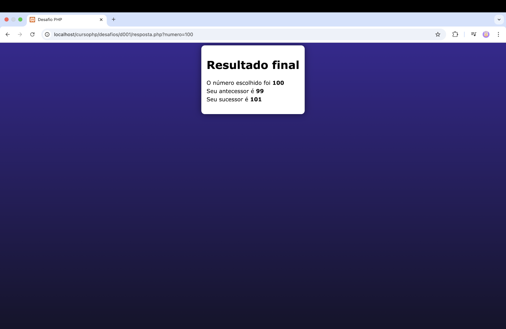

  <h1 align="center">Just a Exercice</h1> 

Calculador de sucessor e antecessor. Um exercício simples para relembrar e treinar um pouco.
 

 <h2 align="center">Inserimos um número:</h2>

    

<h2 align="center">Resultado</h2>

    

